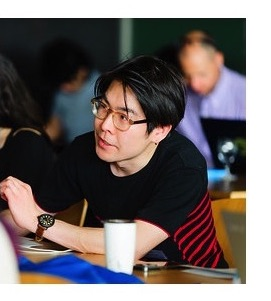

I am a [Reader](https://en.wikipedia.org/wiki/Reader_(academic_rank)) (≈ Associate Professor) and [UKRI Future Leaders Fellow](https://www.ukri.org/our-work/developing-people-and-skills/future-leaders-fellowships/) at University of Edinburgh in the [Department of Linguistics and English Language](https://www.ed.ac.uk/ppls/linguistics-and-english-language) within the [School of Philosophy, Psychology and Language Sciences](https://www.ed.ac.uk/ppls). 

I have served as the (co-)PI of the following two collaborative research projects: 
- UKRI Future Leaders Fellowship: **[Logic in Semantic Universals](http://www.wataruuegaki.com/flf/)** (2022-2029)
- AHRC/DFG project: **[MECORE: A cross-linguistic investigation of meaning-driven combinatorial restrictions in clausal embedding](https://wuegaki.ppls.ed.ac.uk/mecore/)** (2021-2024)
<!-- - NWO international collaboration project **ModUni: Searching for semantic universals in the modal and attitudinal domains** (2018-2021) -->

I completed my PhD at [MIT Linguistics](http://web.mit.edu/linguistics/) in 2015, and was previously at Leiden University. I am an elected fellow of [the Young Academy of Europe](https://yacadeuro.org/). 

My profiles can also be found on [the University of Edinburgh website](https://www.ed.ac.uk/profile/wataru-uegaki) and [Google scholar](https://scholar.google.co.jp/citations?user=PHs9XX8AAAAJ). 

My pronouns are he/him. My first name _Wataru_ \[wataɾɯ\] is [unaccented](https://www.coelang.tufs.ac.jp/ja/en/pmod/practical/01-08-01.php#:~:text=The%20normative%20Japanese%20accent%20can,fall%20drastically%20in%20unaccented%20words.) while my last name _Uegaki_ \[ɯegaki̥\] has an accent on the second [mora](http://glottopedia.org/index.php/Mora) \[e\], but people typically pronounce them with a stress on the penultimate syllable in English-speaking contexts (and that is fine). 

<!-- I also have the following external appointments in academic journals and conferences:
- an editorial board member of *[Semantics & Pragmatics](http://semprag.org/)*
- a review board member of *[Snippets](http://www.ledonline.it/snippets/)*
- a steering committee member of [Logic and Engineering in Natural Language Semantics (LENLS)](http://www.is.ocha.ac.jp/~bekki/lenls/). -->

---

# What I do.

I am a researcher in **formal semantics and pragmatics**. That is, I study how humans draw various inferences from conversations in natural language, and I try to understand systems governing such human behaviors using theoretical tools made available by linguistics, logic, and cognitive science.

Specifically, I am interested in the **relationship between word meanings and grammatical regularities**. My [AHRC/DFG project](https://wuegaki.ppls.ed.ac.uk/mecore/) investigates how meanings of clause-embedding predicates (such as *believe*, *know*, *surprise* and *wonder* in English) are related to regularities about the types of complement clauses they can combine with, building on cross-linguistic data collection and experimentation. 

<!-- Following my  -->
<!-- My PhD dissertation *[Interpreting questions under attitudes](http://hdl.handle.net/1721.1/99318)* addresses a family of puzzles concerning how the meanings of the so-called propositional attitude verbs (such as *believe*, *know*, *surprise* and *wonder*) are related to the types of complement clauses they can combine with (for example, whether the verb can combine with a question or not).  -->

In addition, I am interested in **cross-linguistic generalisations in the lexical semantics of logical vocabularies**. In [my project funded by the UKRI Future Leaders Fellowship](wuegaki.github.io/flf), my team and I investigate how we can explain such generalisations in terms of what we know about grammar and cognition, by bringing together insights from formal linguistics and evolutionary linguistics. 

<!-- More recently, I am interested in the distinction between **'logical' words** (such as *every* and *or*) and **'non-logical' words** (such as *walk* and *bird*). Is there a fundamental distinction between how these two kinds of word meanings are represented in our mind? I try to address this question by investigating the manifestation of this distinction in **syntax-semantics interface** (i.e., the relationship between meaning and grammar) and [**cross-linguistic universals in word meanings**](wuegaki.github.io/modal-universals/) (i.e., what kind of common properties hold for word meanings across languages).  -->

<!-- I also specialise in **Japanese linguistics**. I investigate various aspects of the grammatical structure of the languages/dialects in Japan, with an aim to uncover the nature of the similarity and differences that the Japanese languages have with other languages in the world. -->

**Teaching and supervision** are an essential part of my academic life. See the [Teaching page](wuegaki.github.io/teaching) for my teaching philosophy, information on classes I have taught, and students I have supervised.

---

# News (recent and upcoming talks, papers etc.)

- **Nov 2025**: Wataru's colloquium talk at UConn Linguistics.
- **Nov 2025**: Wataru has been elected as a fellow of [the Young Academy of Europe](https://yacadeuro.org/).
- **Nov 2025**: Özyıldız & Qing et al. ["Operationalizing focus-sensitivity in a cross-linguistic context"](https://lingbuzz.net/lingbuzz/007004) is accepted by _Natural Language Semantics_. 
- **Oct 2025**: Two papers ([Mucha et al.](https://doi.org/10.18148/sub/2024.v29.1263) and [Qing & Uegaki](https://doi.org/10.18148/sub/2024.v29.1279)) published in _Proceedings of Sinn und Bedeutung 29_. 
- **Sept 2025**: Poster presentation "	
Flavors of German necessity modals: experimental evidence" at [Sinn und Bedeutung 30](https://vicom.info/sub30/) (Mucha, Uegaki & Sorace)
- **August 2025**: Come to Wataru's Fringe comedy show! Tickets available [here]( https://www.edfringe.com/tickets/whats-on/the-provocateurs-a-600-year-old-fart-joke-talking-to-machines)

<!-- - **July 2025**: Poster presentation "Automatic Extraction of Clausal Embedding Based on Large-Scale English
Text Data" @ [SCiL 2025](https://wellesley-easel-lab.github.io/SCiL2025/index.html) ([Carslaw](https://people.inf.ed.ac.uk/Iona_Carslaw.html), [Milton](https://people.inf.ed.ac.uk/Sivan_Milton.html), [Navarre](https://www.bramleylab.ppls.ed.ac.uk/member/nicolas/), Qing & Uegaki)
- **May 2025**: Talk by the MECORE members (Qing et al.) "Wondering hopefully and fearfully: How do desires and inquisitive attitudes interact?" at [SALT @ Harvard](https://saltconf.github.io/salt35/)
- **May 2025**: Wataru's talk at [Mayfest @ Maryland](https://linguistics.umd.edu/mayfest2025)
 -->

